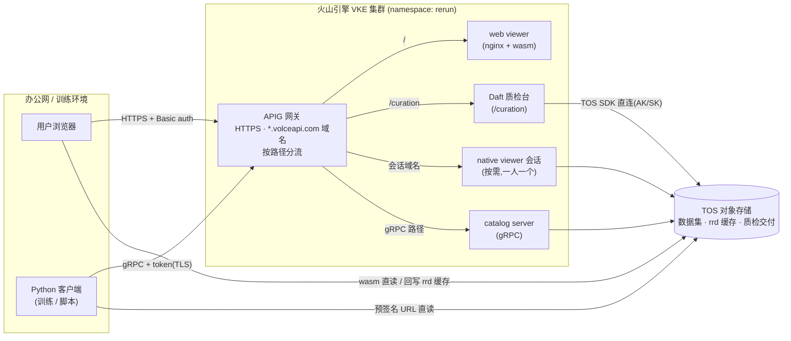

# 产品概述

## 1. 底座:开源 rerun 项目

本产品构建在开源机器人/具身智能领域的多模态数据可视化工具项目 [rerun](https://rerun.io)(GitHub: [rerun-io/rerun](https://github.com/rerun-io/rerun),MIT / Apache-2.0 双许可)之上。

本产品中中可视化体验 — 时间轴回放、3D 视图、曲线图、视图布局 — 基本来自开源 rerun 本体。

## 2. 本产品的工作

在开源 rerun 之上,本产品实现了针对火山引擎的增强和优化,并与 Daft 质检台联动:

| 增强 | 内容 |
|---|---|
| TOS 和 HuggingFace 数据集直读 | viewer 直接打开火山引擎 TOS 或 HuggingFace 上的 LeRobot 数据集,在线转换为 rrd,无需下载到本地 |
| rrd 自动缓存 | 转换产物自动写回 TOS 缓存桶,同一数据集第二次打开直接加载现成 rrd,无须再次转换 |
| 桶 CORS 自助配置 | web viewer 打开新桶时自动补配桶的跨域放行规则(只追加不覆盖),运行时换桶、新建桶都无需预先配置 |
| SDK 与桌面 viewer 随部署分发 | Python SDK 的 wheel 和 Linux 桌面 viewer 与镜像同源构建,由部署在 /downloads/ 提供下载,版本与在跑的服务天然一致 |
| 数据集管理 | catalog server 提供数据集注册、查询和 token 认证 |
| catalog server 持久化 | 注册记录和缓存落在云盘上,服务器重启后数据不丢、无须重新注册 |
| 训练直读 | 训练侧凭 catalog server 签发的预签名 URL 从 TOS 直读数据,不经服务器中转,也无需持有 TOS 密钥 |
| 云上部署形态 | 面向火山引擎 VKE 的完整部署,含 HTTPS 网关入口和按需启动的云上 native viewer 会话 |
| 国内网络适配 | HuggingFace 访问走镜像站,云内组件访问 TOS 走内网 endpoint |
| Daft 质检联动 | web viewer 中一键 Diagnose 跳转 Daft 质检台,数据集 tos:// 路径与地区自动填好 |

这些增强不改变 rerun 的使用方式,已熟悉开源 rerun 的用户没有额外学习成本。

## 3. 组件构成

整套服务部署在一个 Kubernetes namespace(`rerun`)中,共四个组件。

### 3.1 Web viewer(常驻)

浏览器中使用的可视化界面,本体是编译成 wasm 的 rerun viewer,由 nginx 容器托管。

- 访问方式:浏览器打开网关分配的 `https://xxx.volceapi.com` 域名,Basic auth 认证。
- 输入 `tos://桶/路径/数据集名/` 直接打开 TOS 上的 LeRobot 数据集(v2 / v3 均支持),也可打开 HuggingFace 上的公开数据集。
- LeRobot → rrd 的转换在用户浏览器内完成,数据直接从 TOS 读取;转换产物写回 rrd 缓存桶,二次打开直接加载。
- 数据集打开后提供 **Diagnose 按钮**,跳转质检台并自动带上数据集名(见 5.2)。
- 数据集超出浏览器内存限制时,viewer 会提示改用 native viewer(见 3.4)。

### 3.2 Catalog server(常驻,与 web viewer 同一个 pod)

数据集的注册目录和训练取数入口,gRPC 服务,端口 51234。

- 客户端为 Python SDK:云外 `rerun.catalog.CatalogClient("rerun+https://<网关域名>:443", token=…)`(gRPC 经网关按路径分流,TLS 加密),云内直连集群地址 `rerun+http://…:51234`。
- 注册:`dataset.register("tos://…")` 将 TOS 上的 rrd 登记进目录;登记的只是元数据,数据本体留在 TOS。
- 认证:token 制。管理员持有签名密钥,离线为每个用户签发 token,token 中限定用户名、读/写权限、有效期和允许连接的服务器地址;server 用同一密钥验签。
- 训练直读:dataloader(`RerunIterableDataset` 等)取数时,server 只处理查询并对命中的数据块签发预签名 URL,训练机凭 URL 直接从 TOS 读取字节。
- 持久化:注册记录和缓存存放在云盘上;采用 StatefulSet 部署,保证同一时刻只有一个实例挂载该盘。

### 3.3 Daft 质检台(常驻,独立工作负载)

机器人数据质量检查控制台(robot-curation UI),基于 Daft 数据处理引擎,其功能由 Daft 侧提供,本产品负责部署与联动。

- 访问方式:web viewer 同一域名下的 `/curation` 路径,与 viewer 共用同一份登录账号表,登录一次两边通行。
- 数据面:TOS SDK 直连(与 viewer 共用同一对 AK/SK)。数据集来源与交付去向
  都是用户在界面上运行时填的 tos:// 路径 + 地区,不静态挂载、也不在部署时
  绑定任何桶;跑批先落本地缓存,交付按「完整性标志最后传」的协议整树上传。
- 与 rerun 是两个独立的工作负载:质检是批处理任务,与交互式 viewer 分开部署互不影响,升级 viewer 不会中断质检任务。

### 3.4 Native viewer(按需)

web viewer 以 wasm 形式运行在浏览器中,受 wasm 运行环境限制:32 位地址空间,可用内存不足 4 GB,GB 级数据集打不开。
native viewer 是原生进程,没有这些限制,可用内存只取决于所在机器。
本产品提供两款 native viewer,与 web viewer 共用同一套实现,TOS / HuggingFace 直读和 rrd 缓存能力完全一致:

- **本地 native viewer**:在用户本机运行,TOS 凭证读取本机 `~/.rerun/tos-config.json`。适合本机资源充足的场景,数据经公网从 TOS 读取。
- **云上 native viewer 会话**:一人一个 pod,自助启动,用完删除,通过浏览器远程操作;每个会话有独立的访问域名和会话密码。运行在云上节点,经内网访问 TOS,速度快且不产生公网流量。不随常驻服务部署,按需拉起(步骤见部署文档)。

## 4. 架构总览

架构可概括为三条链路:

- **人看数据**:浏览器 → APIG 网关(HTTPS + Basic auth)→ 同一域名下 `/` 是 viewer、`/curation` 是质检台;数据字节由浏览器直接从 TOS 读取。
- **训练取数据**:Python 客户端 → 同一个网关域名(gRPC 按路径分流,TLS)→ catalog server(token 认证)查询元数据,再凭预签名 URL 直接从 TOS 读取字节。
- **数据存储**:所有数据存放在 TOS,各组件读写同一批桶。

## 5. 关键设计

### 5.1 一个公网入口,按路径分流

整套服务只有一个公网入口 —— APIG 网关分配的域名,全部流量 HTTPS/TLS:

| 路径 | 承载 | 认证 |
|---|---|---|
| `/` | web viewer | Basic auth |
| `/curation` | 质检台 | Basic auth(与 viewer 共用账号表) |
| gRPC 服务路径 | catalog server(网关按 gRPC 转发到 51234) | token |
| `/api` `/catalog` `/version` | catalog 的 HTTP 端点(ensure-cors、presign、健康检查) | 按端点(presign 走 token,version 免认证) |
| `/downloads/` | SDK 与桌面 viewer 下载 | Basic auth |
| 会话域名 | native viewer 会话 | 会话密码 |

浏览器类功能用 Basic auth,catalog 类功能用 token,两套认证互相独立。
所有公网入口统一走网关(TLS 终结),没有任何绕过网关的直连四层入口。

### 5.2 viewer 与质检台同域名、按路径分流

rerun 和质检台是两个独立部署,但挂在同一个网关域名下(`/` 和 `/curation`),因此:

- Diagnose 按钮的跳转地址是相对路径 `/curation?dataset=tos://…&region=…`
  (数据集完整路径 + 桶所在地区,质检台两个连接输入直接填好),viewer 无需配置质检台的域名;
- 两边共用同一份账号表,浏览器缓存的凭证自动通行 — 任意账号登录一次,两边有效。

### 5.3 数据不经过服务器

浏览器看数据和训练拉数据,数据字节都不经过任何中间服务:浏览器经 wasm 直连 TOS,训练机凭预签名 URL 直连 TOS。
catalog server 只处理元数据查询和签名,带宽和负载不随数据量增长。
验证方法:取得元数据后停掉 server,直读应照常完成([03-test.md](03-test.md) 有具体步骤)。

### 5.4 rrd 缓存是加速手段,不是数据源

打开数据集时 viewer 先查 rrd 缓存桶,命中则直接加载,未命中才现场转换并回写。
同一数据集第一次打开慢、第二次快是预期行为;删除缓存产物不丢数据,只是下次打开重新转换。

### 5.5 国内网络适配

- HuggingFace 相关操作走 `hf-mirror.com` 镜像站;
- 云内组件访问 TOS 走内网 endpoint(`ivolces.com`),下发给浏览器和云外客户端的必须是公网 endpoint(`volces.com`)。方向配反是常见故障,见 [03-test.md](03-test.md) 排查一节。

## 6. 典型使用流程

1. 数据集上传到 TOS 的 `datasets/` 目录。
2. 浏览器打开 web viewer,输入 `tos://桶/datasets/数据集名/`,逐帧检查视频和关节曲线。
3. 发现可疑数据,点 **Diagnose** 跳转质检台(免再登录,数据集已自动选中),运行质检管线,产出质检报告。
4. 数据确认可用后,用 Python 脚本连接 catalog server(带 token),`register` 注册数据集。
5. 训练代码用 `RerunIterableDataset` 按名字取该数据集,数据经预签名 URL 从 TOS 直达训练机。
6. 需要细看超出浏览器内存的大数据集时,自助拉起 native viewer 会话,浏览器远程操作云上原生 viewer,用完删除。

部署步骤见 [02-deploy.md](02-deploy.md),部署后验证见 [03-test.md](03-test.md)。
