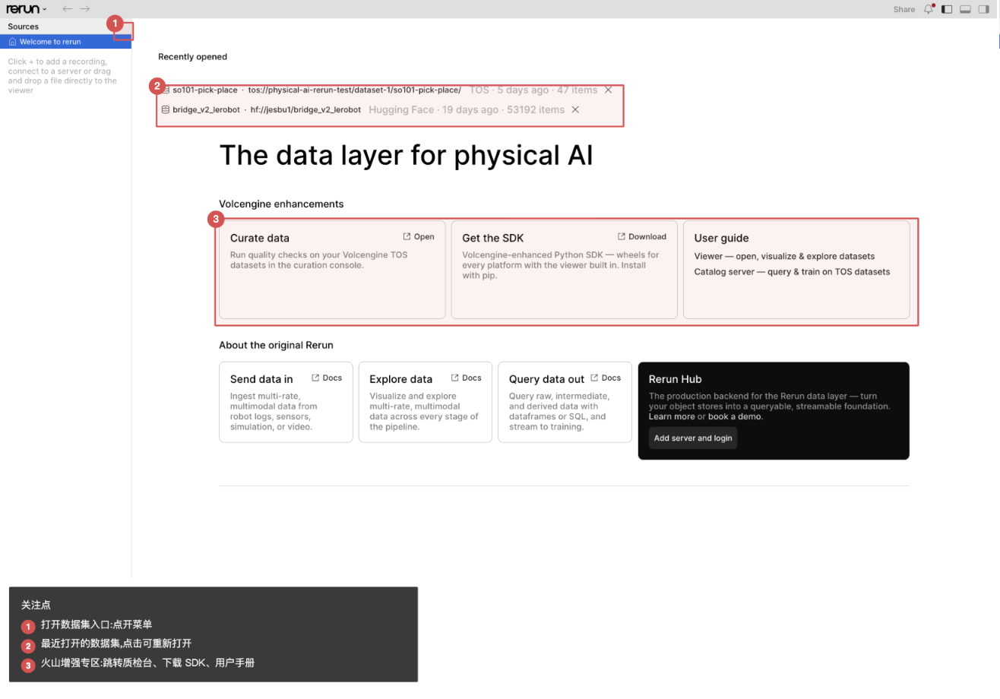
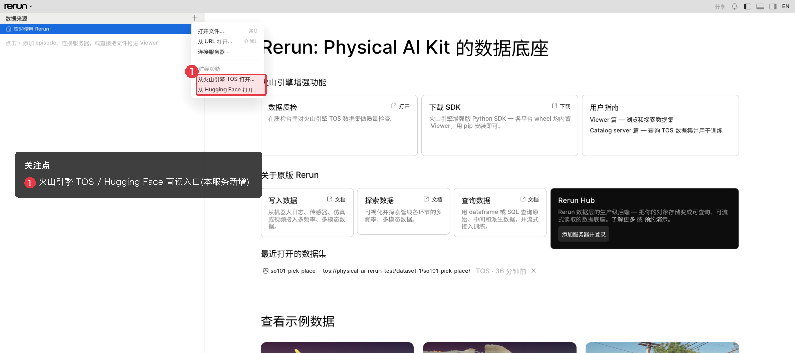
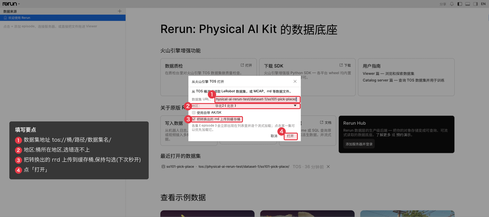
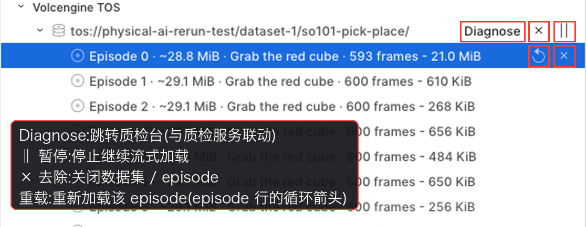
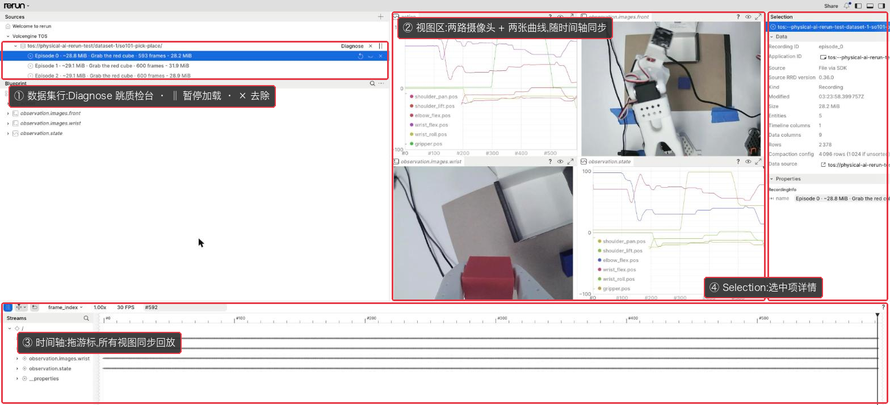

# Viewer 使用指南

本文教你用 rerun viewer 查看机器人数据集,面向第一次接触本服务的用户,不需要预先了解 rerun。

rerun 是开源的时序多模态数据可视化工具(官网 [rerun.io](https://rerun.io)),本服务在它基础上针对火山引擎做了增强。本文重点讲这些增强能力。

本服务提供三种 viewer(web、本地 native、云上 native viewer)。
先看第 1 节挑一种,日常首选浏览器里的 web viewer。

## 1. 三种 viewer,怎么选

本服务提供三种 viewer,底层是同一套实现,TOS / HuggingFace 直读和 rrd 缓存能力一致,区别在运行位置和内存上限:

| | **Web viewer** | **本地 native viewer** | **云上 native viewer** |
|---|---|---|---|
| 运行在 | 你的浏览器 | 你自己的机器 | 云端节点上的原生程序 |
| 打开方式 | 浏览器打开服务地址 | 装 SDK 后运行 `rerun` 命令 | 自助拉起,浏览器里经远程桌面(VNC)操作 |
| 内存上限 | 约 1.4 GB,较大的数据集可能打不开 | 取决于本机内存 | 取决于云节点,通常很大 |
| 适合 | 日常查看,随开随用 | 本机资源足、要看大数据集 | 看超大数据集、要内网速度 |

Web viewer 的最大限制来自 WASM:它在浏览器里以 WebAssembly 运行,受 32 位地址空间约束,实际可用内存只有约 1.4 GB,所以较大的数据集可能打不开或加载中崩溃。
两种 native viewer 是原生程序,没有这个限制,可用内存只取决于所在机器。

反过来,web viewer 能更好地与火山引擎的其他云服务联动 —— 例如一键跳转质检台对数据集做质检(Diagnose,见第 6 节),这是 native viewer 不具备的。

拿不准选哪个,就用 web viewer —— 打开浏览器就能用,一般都够用。
只有当数据集大到 web viewer 打不开时,才换 native viewer(打开方式见第 2 节)。
三种 viewer 打开数据集、查看数据的操作基本一致,本文第 3 节起都以 web viewer 为例。

## 2. viewer 的安装和打开

三种 viewer 的进入方式不同,按第 1 节选好后对号入座。
打开后看到的欢迎页大同小异(见 2.1;native 版的小差别在 2.2 说明)。

### 2.1 Web viewer:用域名打开

Web viewer 的地址就是管理员给你的服务地址,形如 `https://<你的网关域名>/`。
本文示例用 `https://snjeoa6admgt5t57qrqrn.apigateway-cn-beijing.volceapi.com/`,请替换成你自己的。

在浏览器地址栏输入这个地址,回车,浏览器会弹出登录框,填入管理员给你的用户名和密码即可进入。

- 登录框是浏览器原生的账号密码弹窗,不是网页里的表单。
- 同一个账号在质检台(`/curation` 路径)通用,登录一次两处都通。
- 一定要用 `https://` 域名访问,不要用 IP;视频回放依赖 HTTPS 安全环境,用 IP 会导致视频区域黑屏。

进入后看到的是 viewer 的欢迎页(下图为 web 版;native viewer 的欢迎页与此类似,差别见 2.2):



欢迎页上需要关注三处:

- 左上角的 **`+`** 按钮:打开数据集的入口(见第 3 节)。
- 右侧 **Recently opened**:最近打开过的数据集列表,点一下就能重新打开。
  远程数据集不会常驻,重启服务后列表会清空,但随时可以按第 3 节的方式再打开。
- **Volcengine enhancements** 一排卡片:本服务的快捷入口,点卡片右上角的链接直达 ——
  - **Curate data**:跳转质检台(见第 6 节;这里进去是空白表单,想带着当前数据集跳转用数据集行上的 Diagnose 按钮);
  - **Get the SDK**:打开 SDK 下载页(即 2.2 节的 `/downloads/sdk/`);
  - **User guide**:本手册的两篇文档(viewer 篇和 catalog 篇),点开直接在 viewer 里阅读 —— 文档内置在 viewer 中,不依赖任何网络;要把文档转发给别人时,可用部署自带的网页版 `https://<网关域名>/docs/`。

  下方 **About the original Rerun** 一排是开源 rerun 的通用文档和官方服务入口,与本服务无关,一般用不到。

### 2.2 本地 native viewer:下载安装到本机

本地 native viewer 随 Python SDK 一起分发,装好 SDK 后 `rerun` 命令即可用,无需另外下载。

SDK 就放在 web viewer 那个域名下的 `/downloads/sdk/`,即 `https://<你的网关域名>/downloads/sdk/`(用登录账号访问)。
浏览器打开这个页面能看到可下载的 wheel 文件,目前提供四种:Linux x86_64、Linux arm64、macOS(Apple Silicon)、Windows x86_64。
按你的机器选对应的那个 wheel,在 Python(3.10 及以上)环境里安装(URL 末尾换成你选的 wheel 文件名):

```sh
pip install "https://<用户名>:<密码>@<网关域名>/downloads/sdk/<wheel 文件名>"
```

装好后打开:

```sh
rerun            # 直接打开 viewer 窗口
```

TOS 凭证读你本机的 viewer 配置文件 `config.json`,配好后在窗口里打开同一个 `tos://` 地址即可。
配置文件放在用户主目录的 `.rerun` 文件夹下,不同系统的路径写法不同:

| 系统 | 配置文件路径 |
|---|---|
| Linux / macOS | `~/.rerun/config.json` |
| Windows | `%USERPROFILE%\.rerun\config.json`(一般就是 `C:\Users\<用户名>\.rerun\config.json`) |

文件内容(JSON,凭证问管理员要):

```json
{
  "tos_endpoint": "https://tos-s3-cn-beijing.volces.com",
  "tos_rrd_artifacts_url": "tos://<rrd 缓存路径>",
  "tos_access_key": "AK…",
  "tos_secret_key": "SK…",
  "hf_token": "hf_…"
}
```

`tos_rrd_artifacts_url` 是转换产物的 rrd 缓存路径(桶+前缀),问管理员要,和云端部署配同一个 —— 这样二次打开数据集能直接命中共享缓存、秒开。
不写这行(或写 `"off"`)= 不启用缓存,每次打开都现场转换,功能不受影响只是慢。

`tos_endpoint` 和它是配合使用的:填 rrd 缓存桶所在区域的 endpoint,viewer 从这个域名自动识别区域并用它访问缓存桶,不需要也没有单独的 region 配置。
数据集本身在哪个区域无所谓 —— 打开数据集的窗口里有独立的 Region 下拉,按数据集选即可。

如果你还要打开 Hugging Face 数据集且直连 `huggingface.co` 不通,加一行 `"hf_endpoint": "https://hf-mirror.com"` 指向镜像站。

`.rerun` 文件夹不存在就自己建一个(Windows 在 cmd 里执行 `mkdir %USERPROFILE%\.rerun`)。
这个文件里有密钥,别提交到代码仓库;Linux/macOS 上建议 `chmod 600` 只留自己可读。
不配这个文件也能用 —— 打开数据集的窗口里可以手动填凭证,配置文件只是帮你预填默认值。
数据经公网从 TOS 读取,适合本机资源充足的场景。

本地 native viewer 的欢迎页与 web 版基本相同,差别只有一点:Volcengine enhancements 一排只有 **User guide** 一张卡(文档内置在 viewer 里,照常可读)。
另外两张(质检台、下载页)是部署域名下的网页,本地程序不知道你的部署地址所以不显示,需要时直接用浏览器访问对应页面即可。

### 2.3 云上 native viewer 会话:请管理员按需创建

这种方式在云端节点上跑起一个原生 viewer 进程,你通过浏览器里的远程桌面(VNC)操作它,如同远程使用一台云端机器。
它经内网访问 TOS,速度快且不产生公网流量,适合看超大数据集。

会话不常驻,按需创建:

1. 向管理员申请创建一个会话,拿到会话专属的域名和访问密码。
2. 浏览器打开 `https://<会话域名>/vnc.html?autoconnect=true&resize=remote`,输入访问密码,进入远程桌面。
3. 远程桌面里 rerun viewer 已在运行,像本地一样打开 `tos://` 数据集即可。
4. 用完通知管理员删除会话(各会话相互独立、互不影响)。

## 3. 打开 TOS/HF 数据集

这是本服务最主要的能力:直接打开火山引擎 TOS 上的数据集,无需先把数据下载到本地。

关于当前支持的数据格式,有一点要先说明:

> 本服务目前主要支持机器人数据集(LeRobot 格式,v2 / v3 均可)。
> 这类数据由 parquet 表格和 mp4 视频组成,不是 viewer 能直接渲染的格式,
> 所以打开时会在线转换成 rerun 的 rrd 格式再显示。
> 转换需要读取整个数据集并重新编码,第一次打开会比较慢;
> 为此本服务做了缓存,第二次打开同一数据集直接秒开(见第 5 节)。

### 3.1 选择数据源

点左上角 **`+`**,在弹出的菜单里选 **Open from Volcengine TOS…**。



菜单里 **Open from Volcengine TOS…**(火山 TOS)和 **Open from Hugging Face…**(HuggingFace)是本服务的直读入口。
上半部分的 Open file / Open from URL / Connect to a server 是 rerun 自带的通用入口,本服务日常用不到。

### 3.2 填写数据集地址

在弹出的对话框里填三样东西,然后点 **Open**。



| 输入项 | 说明 |
|---|---|
| **Dataset URL** | 数据集在 TOS 上的地址,写法 `tos://桶名/路径/数据集名/`。示例:`tos://physical-ai-rerun-test/dataset-1/so101-pick-place/` |
| **Region** | 桶所在地区,从下拉里选(示例数据在 `cn-beijing`)。选错地区会连不上桶。 |
| **Upload converted rrd to the artifacts store** | 是否把转换结果写回缓存(默认勾选)。保持勾选,下次打开同一数据集会直接秒开,详见第 5 节。 |

### 3.3 选择 episode,认识面板上的按钮

点 Open 后,左侧 **Sources** 面板下会列出数据集里的各个 episode(片段)。
每条显示片段序号、任务描述和帧数,例如 `Episode 0 · Grab the red cube · 593 frames`。
这些片段会自动逐个流式载入,无需手动下载;点其中一条即可查看它,也可让它优先加载。

数据集和每个 episode 旁边有几个控制按钮,鼠标移上去会显示名称:



| 按钮 | 位置 | 作用 |
|---|---|---|
| **Diagnose** | 数据集行 | 跳转质检台并自动填好当前数据集(见第 6 节) |
| **暂停 `‖`** | 数据集行 | 停止继续流式加载(episode 是逐个流式载入的,暂停后不再往下载) |
| **去除 `×`** | 数据集行 | 把该数据集从 viewer 移除 |
| **重载 `↻`** | episode 行 | 重新加载这一段(例如加载中断后重试) |
| **去除 `×`** | episode 行 | 关闭这一段 |

### 3.4 打开 HuggingFace 数据集

除了 TOS,viewer 也能直接打开 HuggingFace 上的公开 LeRobot 数据集。
点 **`+`** → **Open from Hugging Face…**,填入数据集名(例如 `lerobot/pusht`)即可。
国内访问已自动走镜像站,无需额外配置;转换和缓存行为与 TOS 数据集一致。

## 4. 看数据:界面导览

加载 episode 后,界面分成四块:



- **中间:视图区**。本例自动排了四个视图 —— 两路摄像头画面(`observation.images.front` 顶部俯视、`observation.images.wrist` 手腕视角)和两张曲线图(`action` 动作指令、`observation.state` 关节状态)。
- **底部:时间轴**。拖动时间轴上的游标,所有视图同步回放到那一帧。左侧有播放/暂停、播放速度、帧率和当前帧号。
- **左侧:Sources 和 Blueprint**。Sources 是数据源和 episode 列表;Blueprint 是视图布局树,控制显示哪些视图、怎么排列。
- **右侧:Selection**。点中任意视图或数据条目,这里显示它的详细信息(记录 ID、大小、实体数、数据来源等)。

基本操作:

- **回放**:拖时间轴游标,或点左下角播放键。
- **看某一路数据**:在中间视图里直接看;曲线图可框选放大,摄像头画面随时间轴走。
- **调布局**:视图都可以拖动、缩放、关闭。

这套可视化体验(时间轴、视频、曲线、布局)基本来自开源 rerun,已经熟悉 rerun 的用户没有额外学习成本,想深入可查 [rerun 官方文档](https://rerun.io/docs)。

## 5. 二次打开为什么更快:rrd 缓存

如第 3 节所说,第一次打开一个数据集要在线把它转换成 rrd,所以慢。
只要第 3.2 步保持勾选 **Upload converted rrd to the artifacts store**,转换结果会写回缓存桶;
下次再打开同一个数据集,直接加载现成的 rrd,跳过转换,明显更快。

要点:

- 第一次慢、第二次快是正常现象,不是出错。
- 缓存只是加速手段,不是数据本身。删掉缓存不会丢数据,只是下次打开会重新转换一次。

### 5.1 提前离线转换,免去首次等待

如果不想让任何人在浏览器里等首次转换,可以用命令行工具 `rerun rrd-convert` 提前把数据集转好、灌进缓存。
这个工具随 SDK 一起分发(装好 SDK 后即可用,安装见第 2.2 节)。

```sh
# 提前转换一个 TOS 数据集(HuggingFace 用 hf://org/name)
rerun rrd-convert tos://<桶>/<路径>/<数据集名>/
```

- 它逐个 episode 处理:已经是最新的直接跳过(只发一次探测请求),其余的下载、转换、写回缓存桶。
- 可以反复跑,数据没变时几乎零成本,适合放进定时任务或数据上线流程里。
- 凭证和缓存位置读本机 `~/.rerun/config.json`(或对应环境变量),用 `--artifacts-url tos://<rrd 缓存路径>` 可指定写到哪个缓存桶。

跑完之后,任何人在 viewer 里打开这个数据集都是直接命中缓存、秒开。

### 5.2 从 viewer 里删除缓存

如果某个数据集的缓存需要清理(例如源数据更新了、想强制重新转换),可以直接在 viewer 里删,不用去 TOS 控制台翻:

- 在 episode 行右键 →「Delete rrd artifact…」删这一段的缓存;在数据集行右键 →「Delete all rrd artifacts…」删整个数据集的缓存。
- 删除前会弹确认框显示具体删哪个对象/目录,确认后才在后台执行。
- 只删缓存,不动 TOS 上的原始数据;删完下次打开会重新转换一次。
- 右键菜单里还有「Copy rrd artifact address」,可复制该缓存产物的地址。

> 这些菜单项只在「缓存确实存在」时才出现;没打开过、还没生成缓存的数据集看不到它们。

## 6. 一键质检:Diagnose

数据集打开后,左侧数据集名字旁边可能有一个 **Diagnose** 按钮。
它把 viewer 和本服务内置的质检台联动起来:点一下跳转到质检台,并自动把当前数据集的 TOS 路径和地区填好,你直接开跑质检即可。


- 跳转到质检台不需要再次登录(与 viewer 共用一套账号)。
- 质检台只帮你预填数据集,不会自动开跑;质检怎么配、怎么看报告属于质检台的范围,这里不展开。

因为这是与其他云服务的联动功能,有两点限制:

- 只在 web viewer 里有,两种 native viewer 没有这个按钮(它们不在浏览器里,无法跳转到质检台)。
- 只对存放在 TOS 上的机器人(LeRobot v2 / v3)数据集提供;不符合条件时,按钮不会出现。

## 7. 小结:一次典型流程

1. 浏览器打开服务地址,登录进 web viewer。
2. `+` → **Open from Volcengine TOS…**,填 `tos://桶/路径/数据集名/` 和地区,点 Open。
3. 在左侧点一个 episode,逐帧检查视频和关节曲线。
4. 发现可疑数据,点 **Diagnose** 跳质检台跑质检。
5. 数据太大 web viewer 打不开时,改用 native viewer(见第 2.2 / 2.3 节);想免去首次转换等待,提前用 `rerun rrd-convert` 灌好缓存。
