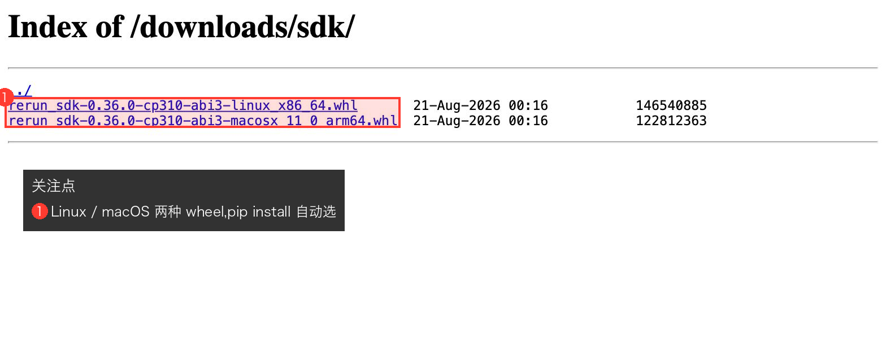

# Catalog Server 使用指南

Catalog server 是本服务的数据集**注册目录**和**训练取数入口**。
本文教你从 Python 里连上它、把 TOS 上的数据集登记进目录、并在训练时直接读取。
面向写训练脚本、做数据管线的工程师。

Catalog server 的三件事:

- **注册**:把 TOS 上的数据集登记进目录,之后按名字引用,不用到处记路径。
- **查询**:列出有哪些数据集、每个数据集有哪些字段。
- **训练取数**:训练时按名字取数据,字节**直接从 TOS 流到你的机器,不经过服务器中转,也不需要你持有 TOS 密钥**(详见第 5 节)。

它是一个 gRPC 服务,你不用关心协议细节,全部通过 Python SDK(`rerun.catalog.CatalogClient`)操作。

## 1. 安装 SDK(随部署分发)

SDK 由**部署本身提供下载**,不走公共 PyPI。
这样装到的 SDK 版本永远和正在运行的 catalog server 一致,不会因为版本不匹配出问题。

浏览器打开 `https://<你的网关域名>/downloads/sdk/`(用登录账号),会看到可下载的 wheel 文件:



目录里同时提供 **Linux x86_64** 和 **macOS(Apple Silicon)** 两种 wheel,按你的机器**自己选对应的那个**。
在你的 Python(3.10 及以上)环境里安装(URL 末尾换成你选的 wheel 文件名):

```sh
pip install "https://<用户名>:<密码>@<网关域名>/downloads/sdk/<wheel 文件名>"
```

- 把 `<用户名>:<密码>` 换成你的登录账号,`<wheel 文件名>` 换成页面上列出的实际文件名。
- 升级:部署更新后,重新 `pip install` 同一个 URL 即可拿到新版。
- 训练直读(第 5 节)用到 PyTorch dataloader,还需 `pip install torch`。
- viewer 已随 wheel 一起分发,装完 SDK 后 `rerun` 命令直接可用(见 [01-viewer.md](01-viewer.md) 第 7 节),无需单独下载。
- Windows、Intel Mac、arm64 Linux 暂无预编译 wheel。

## 2. 拿到并使用 token

Catalog server 用 token 认证。
Token 由**管理员离线签发**给你,是一串字符串,里面限定了你的用户名、读/写权限、有效期,以及允许连接的服务器地址。
你只需要把这串 token 传给 SDK,不需要自己生成。

向管理员申请时说明两点:

- 需要**只读**还是**读写**(注册数据集要读写;只做训练取数,只读即可)。
- 你从哪里连:走公网网关域名,还是集群内网地址(见第 3 节)—— 这决定 token 里签进哪个服务器地址。

拿到 token 后妥善保管,不要提交进代码仓库。

## 3. 连接 catalog server

用 `CatalogClient` 连接,第一个参数是服务器地址,第二个是你的 token。

**从办公网 / 训练环境(云外)连**,走网关域名,`443` 端口,TLS 加密:

```python
import rerun as rr

client = rr.catalog.CatalogClient(
    "rerun+https://<你的网关域名>:443",
    token="<你的 token>",
)
print([d.name for d in client.datasets()])   # 能列出数据集就是连通了(首次可能是空列表)
```

**在集群内(与服务同一个 VPC)连**,可直连内网地址,免走网关:

```python
client = rr.catalog.CatalogClient("rerun+http://<集群内地址>:51234", token="<你的 token>")
```

注意:

- 地址写法是 `rerun+https://` 或 `rerun+http://`,不是普通的 `https://`。
- token 里签进的服务器地址,必须包含你实际连接的这个地址,否则 SDK 会直接拒绝(报 `PermissionError: not allowed for host`)。所以申请 token 时要跟管理员说清楚你从哪连。

## 4. 注册与查询数据集

注册就是把 TOS 上已有的 rrd 数据登记进目录。
**登记的只是元数据,数据本体一直留在 TOS,不会被搬走或复制。**

```python
# 建(或复用)一个数据集
ds = client.create_dataset("so101-pick-place", exist_ok=True)

# 注册 TOS 上的 rrd。参数是列表;整个目录用 register_prefix
task = ds.register(["tos://<桶>/<路径>/<某个>.rrd"])
task.wait(timeout_secs=60)

# 能打印出 schema 就是注册成功了
print(ds.schema())
```

查询:

```python
for d in client.datasets():          # 列出所有数据集
    print(d.name)

ds = client.get_dataset(name="so101-pick-place")   # 按名字取一个
print(ds.schema())                                 # 看它有哪些字段
```

注册记录存在云盘上,**服务器重启后不丢**,不用重新注册(持久化)。

## 5. 训练直读:数据不经过服务器

这是 catalog server 最核心的能力。
训练时,你照常用 SDK 取数,但**数据字节是从 TOS 直接流到你的训练机的,不经过 catalog server 中转,你的训练机也不需要任何 TOS 密钥**。

原理:每取一批数据,SDK 向 server 发一次查询;server 只做两件事 —— 规划要读哪些数据块、并用它自己的密钥为这些块签发**限时下载链接(预签名 URL)**;训练机凭这些链接直接从 TOS 把字节拉回来。
所以 server 的带宽和负载不随数据量增长,你也无需持有 TOS 密钥。

### 5.1 用 PyTorch dataloader 取数

标准用法是 `RerunIterableDataset`,可以直接喂给 PyTorch 的 `DataLoader`。
先看数据集里有哪些可用字段:

```python
import rerun as rr

client = rr.catalog.CatalogClient("rerun+https://<网关域名>:443", token="<read token>")
dataset = client.get_dataset(name="<你的数据集名>")
schema = dataset.schema()

# 可用的 index timeline(样本按它取,给下面的 index=)
for idx in schema.index_columns():
    print("index:", idx)

# 可用的字段(三段式路径)
for col in schema.component_columns():
    if col.archetype and col.component_type:
        print(f"field: {col.entity_path}:{col.archetype}:{col.component_type}")
```

然后写一个取数脚本:

```python
from __future__ import annotations

import torch.multiprocessing
# Rerun 的运行时不是 fork-safe,DataLoader worker 必须用 spawn。
torch.multiprocessing.set_start_method("spawn", force=True)

import rerun as rr
from rerun.experimental.dataloader import (
    DataSource,
    Field,
    NumericDecoder,
    RerunIterableDataset,
)
from torch.utils.data import DataLoader

client = rr.catalog.CatalogClient("rerun+https://<网关域名>:443", token="<read token>")
dataset = client.get_dataset(name="<你的数据集名>")

source = DataSource(dataset=dataset)          # 不填 segments = 全部片段

fields = {
    # 路径按上面 schema 打印出来的真实值改
    "state": Field("<entity_path>:Scalars:scalars", decode=NumericDecoder()),
}

ds = RerunIterableDataset(
    source=source,
    index="<index timeline 名,例如 frame_index>",
    fields=fields,
    fetch_size=128,
)

loader = DataLoader(ds, batch_size=8, num_workers=0)   # 先 num_workers=0 跑通,再加 worker

for batch in loader:
    # batch 是 {字段名: 张量},接你的训练循环
    ...
```

字段的解码器按类型选:标量(关节角、动作)用 `NumericDecoder()`,压缩图用 `ImageDecoder()`,视频流用 `VideoFrameDecoder(...)`。

> **常见坑:`Field` 路径要用短名。**
> schema 打印的是全名 `rerun.archetypes.Scalars:rerun.components.Scalar`,但 `Field` 里要写短名 `Scalars:scalars`(archetype 去掉 `rerun.archetypes.` 前缀,component 用小写复数)。写全名会找不到列。

### 5.2 网络说明

- 预签名 URL 默认指向 TOS 的**公网地址**,所以云外(办公网、训练机)能直接连上。
- 在**同一个 VPC 内**跑训练时,可以让 server 改用内网地址签发,直读走内网,更快、也不产生公网流量 —— 这项由管理员在部署侧配置。
- 办公网从公网地址读大文件可能被网络策略限速(能读通但慢);要跑真实吞吐,在云内节点跑。

## 6. 常见问题

| 报错 / 现象 | 原因与处理 |
|---|---|
| `PermissionError: missing credentials` | 没传 token。 |
| `PermissionError: bad token / invalid signature` | token 和服务器密钥不匹配,或已过期,找管理员重签。 |
| `PermissionError: not allowed for host` | token 里没签进你正连接的服务器地址,申请时说明你从哪连。 |
| `transport error`(连接时) | 多为网络策略拦截:确认用的是 `rerun+https://<域名>:443`(不是裸 IP 或明文 `http`);仍不通找管理员走内网兜底。 |
| `Unauthenticated`(跑 dataloader 时) | token 没带上,或 SDK 是旧版没重装,按第 1 节重装。 |
| dataloader 里 URL 是 `ivolces.com` 且连不上 | server 用内网地址签了 URL,但你在 VPC 外,找管理员把签发地址改成公网。 |
| `Field` 找不到列 | 路径写成全名了,改用短名(见第 5.1 节的坑)。 |

## 7. 小结:一次典型流程

1. 从 `/downloads/sdk/` 装 SDK,向管理员要一枚 token。
2. `CatalogClient("rerun+https://<域名>:443", token=…)` 连上。
3. `create_dataset` + `register` 把 TOS 数据集登记进目录。
4. 训练脚本用 `RerunIterableDataset` 按名字取数,数据从 TOS 直连训练机。
